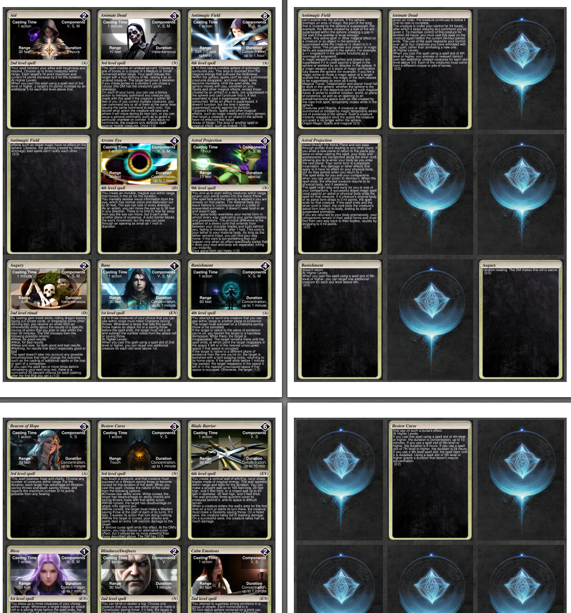

##  spelldeck generator  

Clone:  
`git clone https://github.com/w32agobot/dnd5e_spelldeck_generator`  
`cd dnd5e_spelldeck_generator`  
`git submodule init`  
`git submodule update`  

Dependencies using Python 3.11.2:  
`pip install PyPDF2`  
`pip install bs4`  
`pip install reportlab`  
`pip install pymupdf`  
`pip install frontend`

